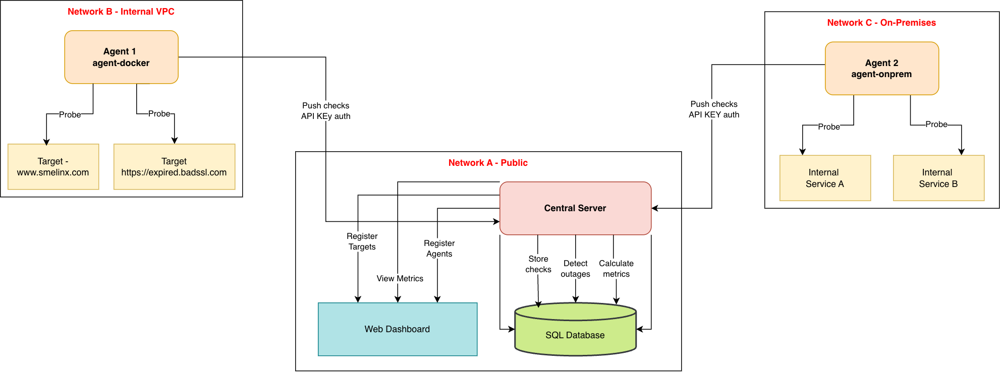

# Status Probe Lite

A lightweight monitoring tool built in Go for tracking web service availability, latency, and outage states. It automatically detects failures, classifies outage reasons, and provides a simple browser-based dashboard for visualization.

## Architecture

Status Probe Lite has two main building blocks:

## Central Server with Multi-Agent Design 



### Central Server

The central server stores monitoring data in an embedded SQLite database and exposes REST APIs to manage monitored targets, register agents, ingest health checks, and expose metrics and outages. It detects outages based on consecutive failed checks, calculates uptime and latency metrics, and serves a static web dashboard for visualization.

### Multi-Agent Design

The system is explicitly multi-agent. Each agent is a small Go binary that can run anywhere: your laptop, a VM in a public cloud, or a server inside a private network or on-premises subnet. Agents authenticate to the central server using per-agent API keys.

Every agent periodically probes its configured URLs, classifies failures (timeout, dns_error, tls_error, non_2xx), and pushes results to the central server via `/api/ingest/checks`.

Because agents push data out, the central server never needs direct network access to the monitored services. You can run the central server in one network (like a public cloud) and run multiple agents in completely different networks while still getting a single dashboard and unified outage view. In short, it's multi-agent and multi-network by design.

## Tech Stack

- **Language**: Go 1.22+
- **Web Framework**: Gin
- **Database**: SQLite (modernc.org/sqlite)
- **Client**: Go net/http
- **Dashboard**: Vanilla JS + HTML (served as static files)
- **Containerization**: Docker + Docker Compose

## Prerequisites

- Go 1.22 or higher
- Docker and Docker Compose
- curl (for API testing)
- git

SQLite is embedded, so no external database setup is needed.

**Note on curl commands**: On macOS or Linux you can copy the commands as-is. On Windows PowerShell, replace single quotes in JSON with escaped double quotes.

## Quick Start with Docker

### 1. Clone the Repository

```bash
git clone https://github.com/niranjini-kathiravan/status-probe-lite.git
cd status-probe-lite/backend
```

### 2. Create Environment File

Create a `.env` file with:

```bash
# Central Server
PORT=8080
DB_PATH=/data/status.db
VERSION=v0.2

# Agent
API_KEY=<replace_with_api_key_after_register>
CENTRAL_BASE_URL=http://server:8080
POLL_INTERVAL_SEC=15
TARGETS_FILE=/app/targets.json
```

You'll fill in the real API_KEY after registering an agent in step 5.

### 3. Build Docker Images

```bash
docker compose build
```

You should see both backend-server and backend-agent built successfully.

### 4. Start the Server

```bash
docker compose up -d server
docker compose logs -f server
```

Check server health:

```bash
curl http://localhost:8080/healthz
# expected: ok
```

### 5. Register an Agent

Register your first agent:

```bash
curl -s -X POST http://localhost:8080/api/agents/register \
  -H 'Content-Type: application/json' \
  -d '{"name":"agent-docker"}'
```

Example output:

```json
{
  "agent_id": 1,
  "api_key": "db5f0ae83a29f1f6f7ea8be771fa9fcd..."
}
```

Copy api_key into your `.env` as API_KEY.

You can repeat this call later to create additional agents, each with their own key and environment.

### 6. Register Targets

Register the URLs to monitor:

```bash
curl -s -X POST http://localhost:8080/api/targets \
  -H 'Content-Type: application/json' \
  -d '{"name":"smelinx","url":"https://www.smelinx.com","timeout_ms":4000}'

curl -s -X POST http://localhost:8080/api/targets \
  -H 'Content-Type: application/json' \
  -d '{"name":"httpbin-503","url":"https://httpbin.org/status/200%2C%20200%2C%20200%2C%20503","timeout_ms":4000}'
```

List registered targets:

```bash
curl -s http://localhost:8080/api/targets | jq
```

#### Registering Targets from the Dashboard

In addition to using curl, you can add monitoring targets directly from the dashboard UI at:

```
http://localhost:8080/dashboard/
```

The dashboard allows you to:
- Enter a target name
- Enter a URL to monitor
- Set a timeout
- Click "Add Target" to register it instantly
- See the new target appear in the UI and in the server's database

This is often easier than using API calls, especially while demoing the tool.

### 7. Export Targets for the Agent

```bash
curl -s http://localhost:8080/api/targets > ./cmd/agent/targets.json
```

This file is bind-mounted into the agent container as its target list.

#### Note: Re-export Targets for Agents (Bind Mounting)

The agent reads its list of URLs to monitor from a local targets.json file. So after you add new targets from the dashboard you must update the file that the agent container uses.

If using Docker:

```bash
curl -s http://localhost:8080/api/targets > ./cmd/agent/targets.json
```

Since the agent container bind-mounts this file:

```yaml
volumes:
  - ./cmd/agent/targets.json:/app/targets.json
```

You must update the file and restart the agent to load the new targets:

```bash
docker compose restart agent
```

**Why this is needed**: The agent does not dynamically fetch targets from the server. This was intentional for the challenge:
- Keeps the agent lightweight
- Works in private networks with no inbound server access
- Keeps the communication model simple (push-only)

In a production version, the agent could actively pull targets from the server.

### 8. Start the Agent

Start one agent via Docker:

```bash
docker compose up -d agent
docker compose logs -f agent
```

You should see logs like:

```
[agent] posting 2 checks...
[agent] posting 2 checks...
```

To demonstrate multi-agent, you can run another agent container with a different name and API key, or run an agent binary from a completely different machine, pointing CENTRAL_BASE_URL at the same server.

### 9. View Dashboard

Open:

```
http://localhost:8080/dashboard/
```

The dashboard shows:

- Targets and their current health (HEALTHY / ISSUE)
- Availability percentages
- Failed checks counts and last failure reason
- Outage state (open / closed)

### 10. Simulate Outage and Recovery

To simulate an outage on a demo target:

```bash
curl -s "http://localhost:8080/demo/set?to=https://httpbin.org/status/503"
```

To simulate recovery:

```bash
curl -s "http://localhost:8080/demo/set?to=https://httpbin.org/status/200"
```

Outages will open after 2 consecutive failed checks and close after 2 consecutive successful checks, and this will be visible on the dashboard.

## Test Targets Used

To properly exercise the monitoring and classification logic, the project uses well-known public test services:

### httpbin.org

httpbin.org is a public HTTP testing service. It lets you return specific HTTP status codes (like `https://httpbin.org/status/503` which always returns 503 Service Unavailable) and simulate latency (like `https://httpbin.org/delay/10` which waits 10 seconds before responding).

We use it to reliably trigger non_2xx failures, simulate timeouts by using delayed responses, and demonstrate failing targets, outage detection, and different failure reasons in the metrics.

### badssl.com

badssl.com provides HTTPS endpoints with intentionally broken TLS configurations, such as expired certificates (`https://expired.badssl.com/`), wrong host names, and untrusted certificate chains.

We use it to trigger tls_error in the agent's classification logic and prove the system can distinguish TLS errors from regular HTTP errors.

Together, httpbin.org and badssl.com give you deterministic ways to generate timeout, dns_error, tls_error, and non_2xx failures, and you can see each of these reasons appear clearly in the dashboard and `/api/metrics` responses.

## API Overview

| Method | Endpoint | Description |
|--------|----------|-------------|
| GET | /healthz | Health check for the server |
| POST | /api/targets | Register a new target |
| GET | /api/targets | List all targets |
| DELETE | /api/targets/:id | Delete a target |
| POST | /api/agents/register | Register a new agent |
| POST | /api/ingest/checks | Agent pushes health check results |
| GET | /api/metrics | Retrieve metrics for a target |
| GET | /api/logs | Fetch historical logs |
| GET | /api/logs/stream | Live log streaming (SSE) |
| GET | /dashboard/ | Web dashboard |
| GET | /demo/set | Toggle outage simulation target URL |

## Outage Rules

| Event | Trigger | Action |
|-------|---------|--------|
| Open outage | 2 consecutive failed checks | Creates outage |
| Close outage | 2 consecutive successful checks | Closes outage |
| Reason | Captured when outage is opened | Stays until end |

## Folder Structure

```
backend/
├── cmd/
│   ├── server/         # Central server entrypoint
│   └── agent/          # Agent binary (multi-agent capable)
├── internal/
│   ├── api/            # HTTP handlers (targets, agents, ingest, logs, metrics)
│   ├── store/          # SQLite data layer
│   ├── config/         # Env-based configuration
│   └── web/static/     # Dashboard (HTML/JS)
├── docker-compose.yml
├── Dockerfile.server
├── Dockerfile.agent
├── targets.json        # Exported targets for agents
├── status.db           # SQLite database
└── .env                # Environment variables
```

## Useful Docker Commands

View logs:

```bash
docker compose logs -f server
docker compose logs -f agent
```

Restart only the agent:

```bash
docker compose restart agent
```

Stop everything:

```bash
docker compose down
```

Check running containers:

```bash
docker ps
```

## Future Improvements

- Alerts: notifications on outage open or close
- User Authentication: multi-tenant dashboards and API key management
- Agent Auto-Discovery: dynamic registration and configuration rollout
- Kubernetes Deployment: Helm chart for scalable deployment across clusters
- Certificate-Based Authentication: instead of API key authentication, certificate-based authentication can also be implemented to have secure communication between agents and central server

## Note
1. SQLite is used to keep setup simple. For production-scale deployments, this architecture can easily switch to PostgreSQL or any managed SQL database.


